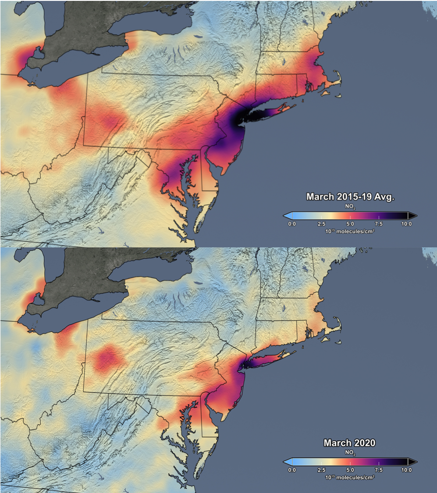
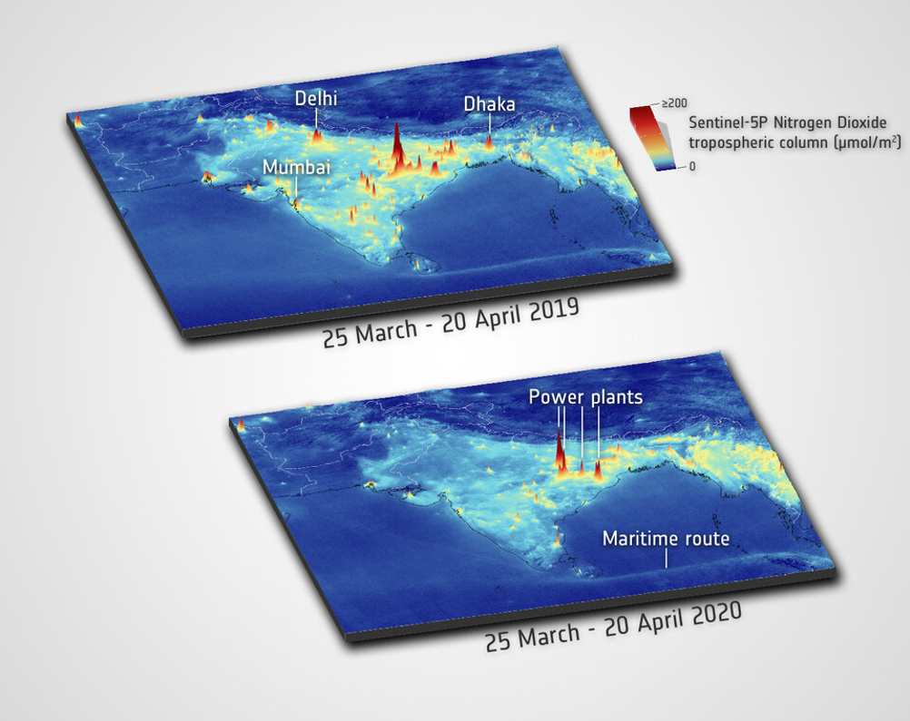
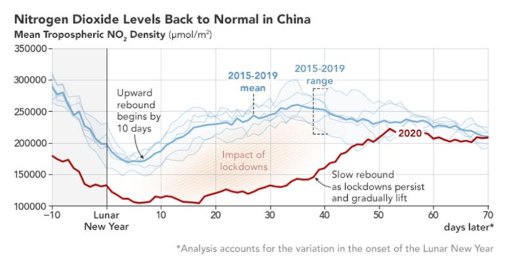

## Examples of COVID-19 impact on Air Quality 

prepared by [ESA](https://www.esa.int)/[NASA](https://www.nasa.gov)

To curb the spread of COVID-19, countries across the world have been implementing various social distancing measures restricting people’s movement and, at times, placing entire countries on lockdown.
During this time, **Earth observing instruments** like the **[Tropospheric Monitoring Instrument (TROPOMI)](https://www.esa.int/Applications/Observing_the_Earth/Copernicus/Sentinel-5P/Tropomi)** on the **[Copernicus](https://www.copernicus.eu/en) Sentinel-5P** satellite and the **[Ozone Monitoring Instrument (OMI)](https://www.nasa.gov/mission_pages/aura/spacecraft/omi.html)** on the **[NASA Aura](https://www.nasa.gov/mission_pages/aura/main/index.html)** satellite have observed significant drops in regional nitrogen dioxide (NO2) levels coinciding with reduced traffic and industrial activity. **NO2 is an air pollutant**. 

OMI, which launched in 2004, is the predecessor to TROPOMI, which launched in 2017. TROPOMI provides higher resolution data, but OMI has a longer data record. 
Because changes in the weather, such as wind speed and cloudiness, can cause nitrogen dioxide levels to vary from day to day, **the data presented here combine and average nitrogen dioxide data to reduce meteorological variability** and to more clearly reveal the impact of changes in human activity on global NO2 levels. 
Comparisons between averaged TROPOMI NO2 levels from 13 March-13 April 2020 and March-April 2019 show reductions of about 50% in Madrid, Milan, Rome and Paris. These reductions coincide with the strict quarantine measures implemented across Europe. 

    
<figcaption>*Sentinel-5P/TROPOMI nitrogen dioxide concentration measurements over Europe - [Weblink](http://www.esa.int/Applications/Observing_the_Earth/Copernicus/Sentinel-5P/Air_pollution_remains_low_as_Europeans_stay_at_home).* </figcaption>

Similar reductions in air pollution have been observed in the Northeast United States (US). Averaged OMI NO2 column data during lockdowns in March 2020 show significantly lower NO2 values compared to averaged March 2015-2019 data.  

<figcaption>*OMI NO2 column observations for northeastern U.S. The image on the top shows the mean for March 2015 through 2019, while the image on the right shows the mean for March 2020
[Weblink](https://airquality.gsfc.nasa.gov/slider/northeast-2020)*</figcaption>

TROPOMI observations over **India** also show reduced NO2 trends during lockdowns: compared to the same timeframes in 2019, averaged NO2 concentrations from 1 January - 24 March 2020 and from 25 March (the first day of the lockdown) - 20 April 2020 show reductions of about 40-50% of air pollution for selected cities like Dehli and Mumbai. 
However, not all cities experienced reductions in nitrogen dioxide. The nearly constant values of NO2 levels over northeast India are due to ongoing operations at coal-based power plants, which did not reduce electric power generation significantly during the lockdown.

<figcaption>*Sentinel-5P/TROPOMI Nitrogen Dioxide concentration measurements over India
[Weblink](http://www.esa.int/ESA_Multimedia/Images/2020/04/NO2_concentrations_over_India)*</figcaption>

#### OMI and TROPOMI are also able to observe rebounds in nitrogen dioxide levels as lockdown measures ease. 

For example, the plot below shows NO2 levels in China rebounding to historical norms after lockdown measures were relaxed – 50 days after the Lunar New Year. As the plot shows, COVID-19 lockdowns in China coincided with the Chinese Lunar New Year, a normally quiet time when nitrogen dioxide levels decrease as many people in China take time off to celebrate the holiday. However, the plot reveals how this year nitrogen dioxide levels remained depressed long after the Lunar New Year ended due to the COVID-19 lockdown measures. It wasn’t until April 2020,50 days after the Lunar New Year, that NO2 levels in China rebounded.

<figcaption>*The mean column density of nitrogen dioxide (NO2)  over China as measured by the OMI satellite in 2020 (red line) and the average from 2015-2019 (blue lines). Time is measured in days before and after the Lunar New Year began. (In 2020, it started on January 25.) [Weblink](https://earthobservatory.nasa.gov/images/146741/nitrogen-dioxide-levels-rebound-in-china)*</figcaption>

This site will continue to be updated with the latest OMI and TROPOMI nitrogen dioxide data throughout the COVID-19 pandemic. 
