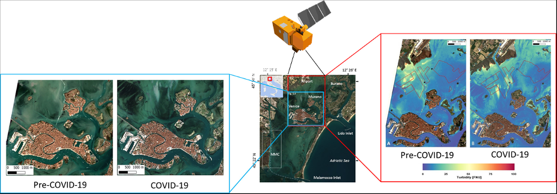
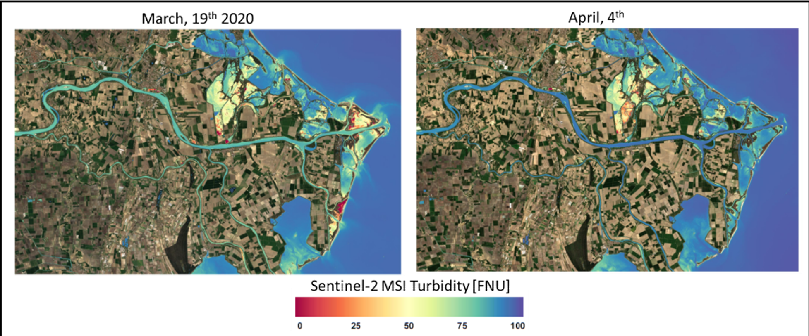

## Impact of COVID-19 on Water Quality

prepared by [ESA](https://www.esa.int)/[NASA](https://www.nasa.gov)/[JAXA](https://global.jaxa.jp/) 

The **Water Quality index** was designed to assess the **effect of the lockdown** and the subsequent recovery on inland and coastal waters by monitoring the deviation from a climatological mean of Chlorophyll-a concentration as measured from optical sensors onboard the three agency’s satellites, namely **[Sentinel-3 (ESA)](http://www.esa.int/Applications/Observing_the_Earth/Copernicus/Sentinel-3)**, **[GCOM-C (JAXA)](https://global.jaxa.jp/projects/sat/gcom_c/)** and **[Aqua (NASA)](https://oceancolor.gsfc.nasa.gov/data/aqua/)**.

Chlorophyll-a (Chl) concentration is an indicator of algae abundance, which fluctuates naturally over space and time, as a result of combined atmospheric and oceanic effects (e.g., marine currents and upwelling). In coastal areas, strongly influenced by river inputs and human activities, higher Chl concentration can result from the discharge of urban sewage, industrial runoffs, and fertilizers from agriculture activities over watersheds. In particular, nutrient inputs of anthropogenic origin affect the natural amount of phytoplankton in marine and inland waters, representing a continuous threat to biodiversity and leading to undesirable modifications of phytoplankton concentration (i.e., eutrophication). 

### Water Quality Maps

The displayed maps show **weekly Chl-a concentration anomalies (%)** for the North Adriatic Sea, the Mediterranean sub-basin most influenced by river runoff, in particular by the Po River, which is the **largest river in Italy and which runs along many different industrialized areas**. 

Moreover, the North Adriatic coastline is a very popular tourist destination. In particular, the displayed area includes Venice, one of the most touristic destination in the world, whose frequentation totally stopped during the lockdown. 
Despite existing differences in the characteristics (spatial, temporal and spectral resolution) of the three optical sensors and in the algorithms used to calculate the Chl-a concentration,  all three sensors highlight a general, **negative trend of Chl concentration anomaly in the Venice Lagoon** as well as offshore the whole Po River coastal zone, starting from the first week of the Italian lockdown (i.e., from March 9th 2020).

In the Venice lagoon, strongly influenced by human activities, this pattern of low Chlorophyll concentration can be most probably linked to the decrease of maritime traffic and tourism frequentation, as highlighted by high resolution Sentinel-2 images available in the area (Fig. 1). 

*Figure 1. S2-derived true-colour images (left panels) and turbidity maps (right panels) in the lagoon of Venice on February, 20th (Pre-COVID-19) and March 19th (COVID-19).*

Offshore the lagoon, this striking negative trend is likely due to natural environmental factors, driven by the particular low Po River water level, low winds, and the resulting well-stratified thermohaline conditions that maintained values of Chl concentration fairy low and hindered riverine sediment and nutrient transport from the northern sector of the basin (Fig. 2). 

*Figure 2. a-Po river level from March, 16th 2020 to June, 15th 2020. b- Mean Sea Surface Temperature for the  week 1st – 8th April (left plot) and for the week 8th-14th April 2020 (right plot). c- Wind measurements in the area from March, 20th to April, 15th  2020*

However, we cannot exclude a mutual role of a decrease of human activities that enhanced the negative anomaly in Chl concentration as highlighted by the low turbidity values in the Po river measured by Sentinel-2 in the lockdown phase (Fig. 3).

*Figure 3. S2-derived turbidity maps in the last inland branch of the Po River March, 19th 2020 (beginning of lockdown) and April, 4th (middle of lockdown).*

